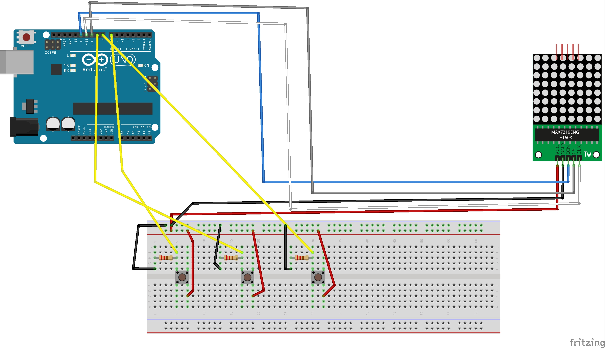

# CLIGNOTANT-VELO-vudavid

le montage du clignotant velo permet d'alllumer sur une matrice une fleche gauche,
une fleche droite ou un warning apres une pression sur un des trois boutons.
projet réaliser en binome par @diaset35 et @orokronos

## Video

cliquer sur la photo pour voir la video

# Photo du montage

# Bibliothèque a utiliser

ledControl 

# Liste des composants

+ 1 Arduino UNO
+ 1 cable Arduino
+ 1 Bread Board
+ 1 Matrice 64 (8*8)
+ 3 Boutons push
+ 3 resistances 220 Ω
+ 10 cables male/male
+ 5 cables male/femelle
